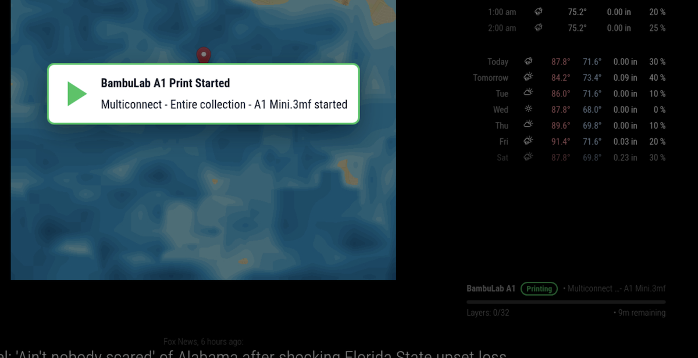
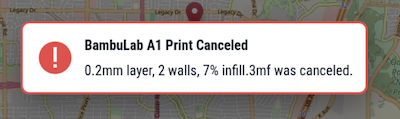
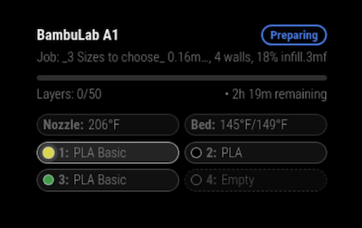
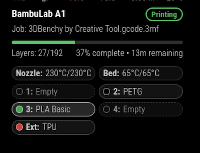

# MMM-BambuLabNotify

[](https://magicmirror.builders/)
[]()
[]()

A [MagicMirror²](https://magicmirror.builders/) module that provides **real-time notifications and status updates** from your **Bambu Lab printer** (tested with A1, should also work with A1 Mini, X1 and P1 series).  

It connects to the printer’s local MQTT broker and shows toast notifications and a status panel for print events like **started, paused, resumed, canceled, finished, and error states**.

---

## ✨ Features

- 📡 Real-time printer status via MQTT over TLS  
- 🔔 Toast notifications for:
  - Print started
  - Print canceled  
  - Print finished  
  - Error conditions  
- 📊 Inline status panel:
  - Current state (Idle, Preparing, Printing, Paused, Canceled, Error, Finished)  
  - Job progress bar (%)  
  - Current file name   
- 🖼 Clean, responsive display that fits MagicMirror layouts  

---

## Screenshots


### Toast Messages




### Panel display





--- 

## 📦 Installation

From your MagicMirror `modules` folder:

```bash
cd ~/MagicMirror/modules
git clone https://github.com/LuckyDuckTx/MMM-BambuLabNotify.git
cd MMM-BambuLabNotify
npm install
```

## ⚙️ Configuration
**Add the Module to `config.js`**:
- 🔑 **Getting your credentials**
  - **IP Address:** Found in your Bambu printer’s settings (Settings > Lan Only section).
  - **Access Code:** Found in your Bambu printer’s settings (Settings > Lan Only section).
  - **Serial Number:** Printed on your printer label and in the Bambu Handy app (Settings > Firmware Version).

- Edit your `MagicMirror/config/config.js` file and add the following configuration:


```javascript
{
  module: "MMM-BambuLabNotify",
  position: "bottom_right",
  config: {
    printerName: "BambuLab A1", 
    host: "192.168.x.xxx",          // Printer IP address
    password: "YOUR-ACCESS-CODE",   // Access Code from printer
    serial: "YOUR-PRINTER-SERIAL",  // Serial Number from printer

    // Toast Message options
    toastDurationMs: 60000, 
    showOnStart: true,
    showOnDone: true,
    showOnError: true,
    showOnIdle: true, 
  }
}
```

## Configuration Options
| Option              | Type    | Default      | Description                                                                                           |
| ------------------- | ------- | ------------ | ----------------------------------------------------------------------------------------------------- |
| `printerName`       | String  | `"Bambu A1"` | Name shown in the panel and toasts.                                                                   |
| `port`              | Number  | `8883"`      | MQTT Port on printer                                                                                  |
| `user`              | String  | `bblp`       | MQTT user on printer                                                                                  |
| `idleAfterCancelMs` | Number  | `60000`      | Time after cancel before panel resets to Idle (milliseconds).                                         |
| `progressStep`      | Number  | `5`          | Bucket size for progress updates. Example: `5` → updates at 0%, 5%, 10% …                             |
| `debounceMs`        | Number  | `15000`      | Minimum time between identical toast notifications (prevents spam).                                   |
| `logRaw`            | Boolean | `false`      | If `true`, logs every raw MQTT message to console (very noisy).                                       |
| `logOnChange`       | Boolean | `true`       | Logs only when state changes (recommended for debugging).                                             |
| `idleTimeoutMs`     | Number  | `180000`     | Auto-reset to idle if no messages received for this duration (ms).                                    |
| `doneQuietWindowMs` | Number  | `120000`     | Suppresses ghost finish/error events if printer hasn’t been recently active (helps after reconnects). |
| `assumeIdleAfterMs` | Number  | `8000`       | Fallback: if nothing arrives after connect, assume Idle to clear “Connecting…” state.                 |
| ** Toasts Messages ** ||||
| `toastDurationMs`   | Number  | `60000`      | How long toast notifications remain visible (milliseconds).                                           |
| `toastStyle`        | String  | `modal`      | Where the toast messages display. "modal" (center + overlay) or "corner" (top-right)                  |
| `showOnStart`       | String  | `true`       | Show Toast while connecting                                                                           |
| `showOnDone`        | String  | `true`       | Show Toast when print is finished                                                                     |
| `showOnError`       | String  | `true`       | Show Toast when an error or cancel occurs                                                             |
| `showOnIdle`        | String  | `true`       | Show Toast when printer becomes idle                                                                  |


## 🛠 Notes

- Works locally on LAN only - MagicMirror and Printer must be on same LAN. 
- Printer does not need to be in `LAN Only Mode`. 
- Tested with Bambu Lab A1 (Aug 2025 firmware version 01.06.00.00).
- All state changes and notifications are logged.


## License
This project is licensed under the MIT License.

---

### Credits

- Created using ChatGPT 5.0 (OpenAI)
- Module inspired and tested by rwlongtx.
---
   
